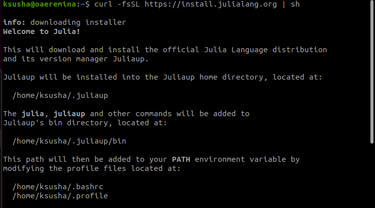
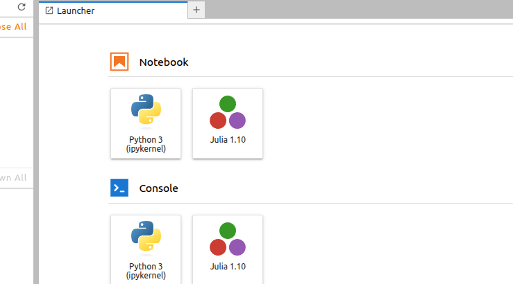
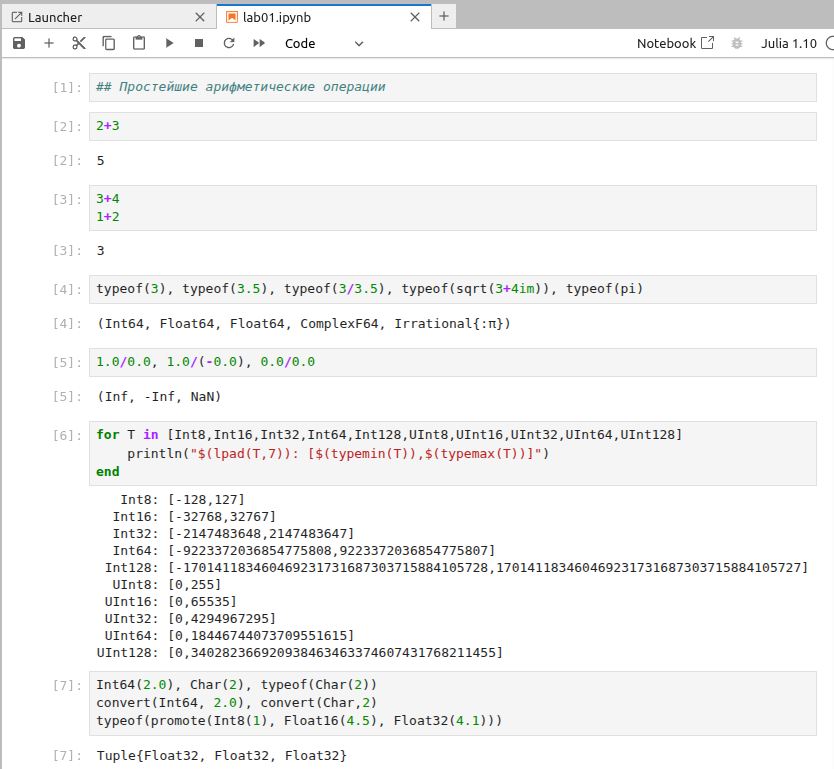
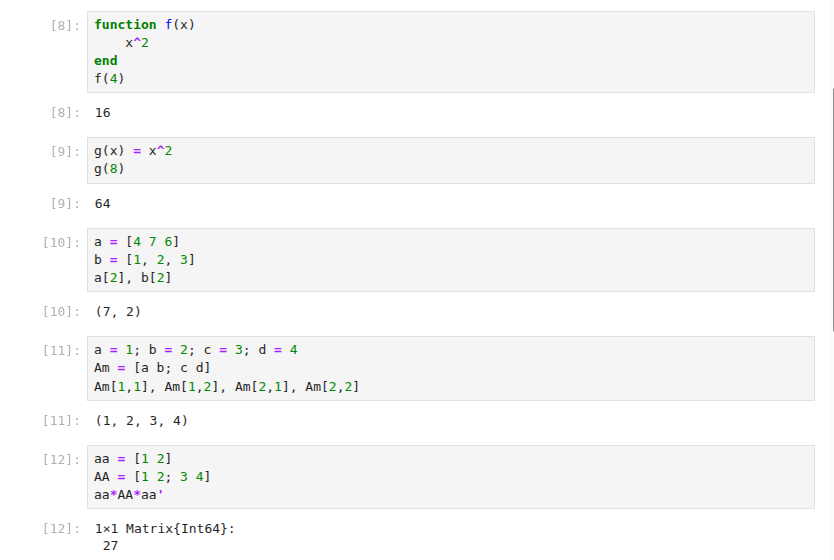
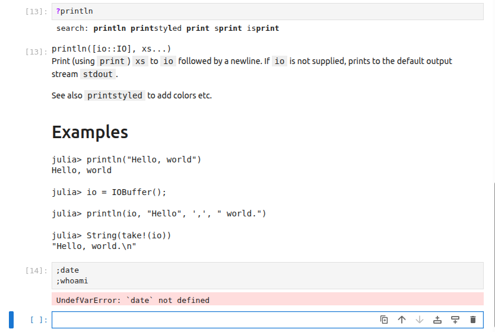
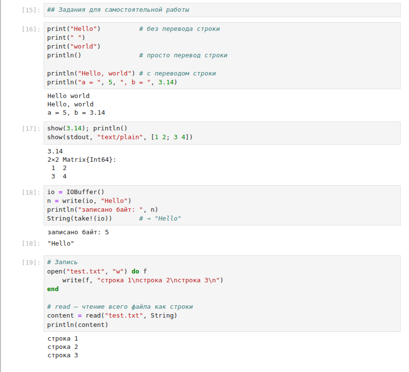
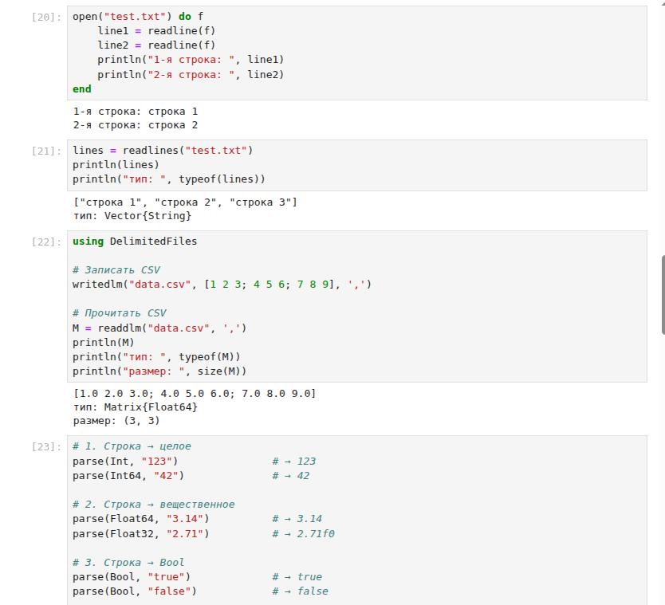
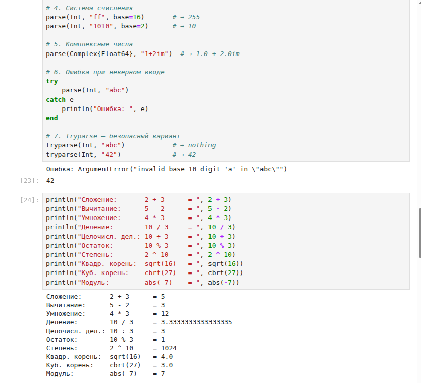
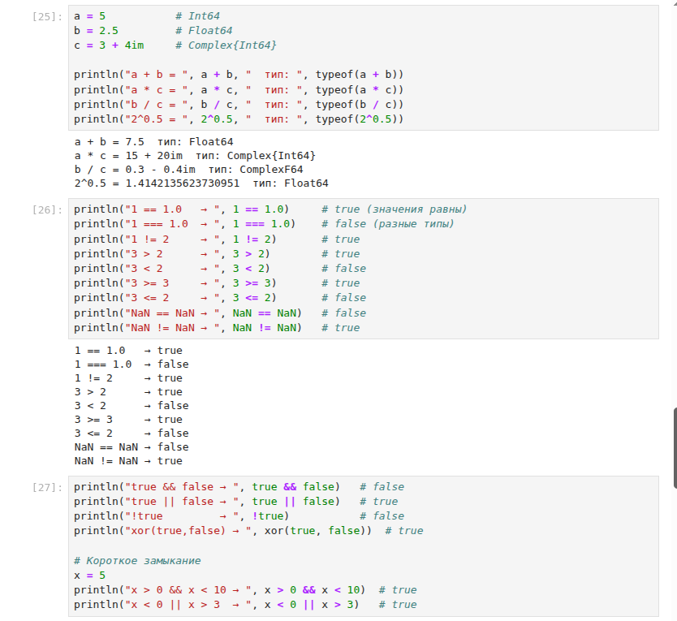
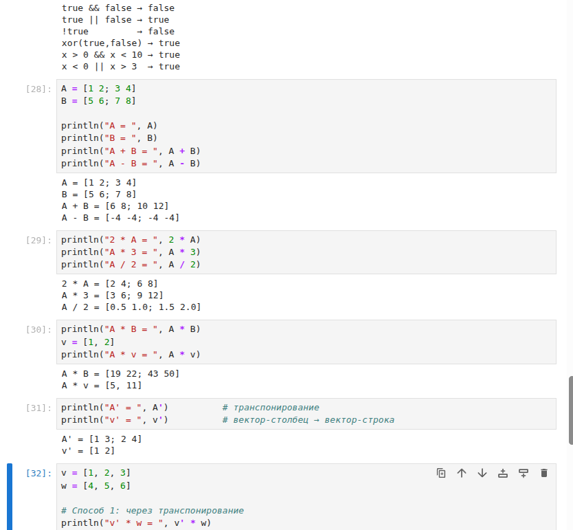

---
## Author
author:
  name: Еремина Оксана Андреевна
  degrees: DSc
  orcid: 0000-0002-0877-7063
  email: 1132236056@rudn.ru
  affiliation:
    - name: Российский университет дружбы народов
      country: Российская Федерация
      postal-code: 117198
      city: Москва
      address: ул. Орджоникидзе, д. 3

## Title
title: "Лабораторной работе №1"
subtitle: "Подготовка стенда"
license: "CC BY"
---

# Введение

## Цель работы

Основная цель работы — подготовить рабочее пространство и инструментарий для работы с языком программирования Julia, на простейших примерах познакомиться с основами синтаксиса Julia.

## Задачи

1. Установить Julia с помощью пакетного менеджера.  
2. Установить Jupyter Lab и пакет IJulia.  
3. Запустить Jupyter Lab и создать новый ноутбук с ядром Julia.  
4. Выполнить примеры из раздела 1.3.3 методических указаний.  
5. Самостоятельно выполнить задания 1–4 по вводу/выводу, парсингу, математическим операциям и операциям с матрицами.

## Объект и предмет исследования

Объект: среда выполнения кода Julia (Jupyter Lab, REPL).  
Предмет: базовые синтаксические конструкции языка Julia и работа с пакетами.

## Методы исследования

В работе использованы следующие методы:

- анализ документации языка Julia и Jupyter;
- установка программного обеспечения с помощью менеджеров пакетов (snap, Pkg);
- экспериментальное выполнение программного кода в интерактивной среде Jupyter Lab;

# Теоретическая часть

Julia — высокоуровневый язык программирования с динамической типизацией, разработанный для научных вычислений [@julia_doc]. Он сочетает скорость выполнения, близкую к C, и простоту синтаксиса, как у Python или MATLAB.

Работа с командной строкой и пакетными менеджерами подробно описана в литературе [@newham_book_learning-bash_en; @robbins_book_bash_en; @zarrelli_book_mastering-bash_en].

Ключевые особенности:

- Компиляция JIT (Just-In-Time) на основе LLVM.  
- Встроенная поддержка многопоточности и распределённых вычислений.  
- Богатая экосистема пакетов (DataFrames, Plots, LinearAlgebra, StatsBase и др.).  
- Возможность работы в Jupyter через ядро IJulia [@ijulia_github].

Для управления пакетами используется встроенный менеджер Pkg. Установка пакета выполняется командой Pkg.add("ИмяПакета").

Jupyter Lab — интерактивная веб-среда для работы с ноутбуками, поддерживающая множество языков (Python, Julia, R и др.) [@jupyterlab_doc].

# Материалы и методы

Оборудование:

- Виртуальная машина на базе Apple Virtualization (Ubuntu Linux).

Программное обеспечение:

- ОС: Ubuntu (версия Resolute).  
- Пакетные менеджеры: apt, snap.  
- Интерпретатор Julia версии 1.12.5.  
- Jupyter Lab версии 4.6.3.  
- Браузер для доступа к Jupyter Lab.

Использование операционной системы Linux и её стандартных утилит рассматривается в [@tanenbaum_book_modern-os_ru].

Методы:

- Установка Julia через snap.  
- Установка IJulia через встроенный менеджер пакетов Julia Pkg.  
- Запуск Jupyter Lab из терминала.  
- Выполнение кода в ячейках ноутбука.

# Выполнение лабораторной работы

## Настройка среды

Julia была успешно установлена через Curl и после устрановки проверена версия

{#fig-001 width=70%}

После запуска в браузере открылся интерфейс JupyterLab. В панели Launcher доступны ядра Python 3 и Julia 

{#fig-001 width=70%}

## Выполнение примеров (раздел 1.3.3)

В ноутбуке выполнены примеры:
- арифметические операции (2+3, 3+4, 1+2)
- подавление вывода с помощью ;
- определение типов числовых величин (typeof)
- вывод диапазонов целочисленных типов
- справка по функции println (?println)
- команда ;pwd для вывода текущей директории

{#fig-001 width=70%}
{#fig-001 width=70%}
{#fig-001 width=70%}

## Выполнение заданий 

### Задание 1. Функции ввода/вывода

Выполнен код:

- print, println, show;
- побайтовую запись через write в IOBuffer;
- запись и чтение файлов (write, read, readline, readlines);
- чтение табличных данных через readdlm (пакет DelimitedFiles).

Вывод программы показывает корректное выполнение всех операций

{#fig-001 width=70%}

### Задание 2. Функции parse()

- преобразование строки в Int64 (parse(Int, "123"));
- преобразование в Float64 (parse(Float64, "3.14"));
- преобразование строки в Bool;
- парсинг числа в заданной системе счисления (base=16);
- генерация ошибки при попытке парсинга нечисловой строки и безопасный вариант через tryparse.

{#fig-001 width=70%}
{#fig-001 width=70%}

### Задание 3. Математические операции 

С переменными a = 10 и b = 3 выполнены:
- арифметические операции (+, -, *, /, div, rem, ^);
- вычисление квадратного и кубического корня (sqrt, cbrt);
- операции сравнения (==, !=, >, <, >=, <=);
- логические операции (&&, ||, !).

{#fig-001 width=70%}

### Задание 4. Операции с матрицами и векторами

Подключён пакет LinearAlgebra. Созданы матрицы A, B и вектор v. Выполнены:

- сложение и вычитание матриц;
- умножение на скаляр;
- матричное умножение (A * B);
- транспонирование (A');
- скалярное произведение (dot);
- поэлементные операции (.*, ./, .^);
- умножение матрицы на вектор

{#fig-001 width=70%}

# Результаты

- Установлены Julia (версия 1.12.5) и Jupyter Lab (версия 4.6.3).  
- Установлен пакет IJulia для работы Julia в Jupyter.  
- В Jupyter Lab создан ноутбук с ядром Julia.  
- Успешно выполнены все примеры и задания.  
- Получены корректные результаты вычислений, включая работу с матрицами и векторами.  
- Все скриншоты зафиксированы и приложены к отчёту.

# Обсуждение результатов

Все задания выполнены без ошибок. Установка через snap оказалась удобным решением, так как пакет julia отсутствовал в стандартных репозиториях apt. Пакет IJulia установился без проблем и корректно зарегистрировался как ядро для Jupyter.

# Заключение

В ходе лабораторной работы были выполнены все поставленные задачи.

Цель работы достигнута. В дальнейшем планируется изучение более сложных пакетов Julia для статистического анализа и визуализации данных.

# Список литературы {.unnumbered}

::: {#refs}
:::

