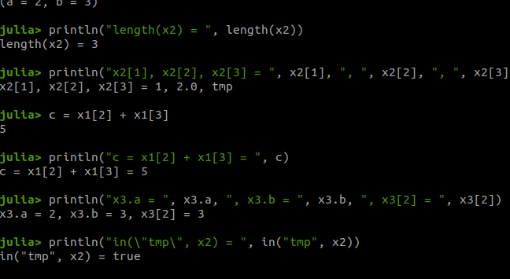
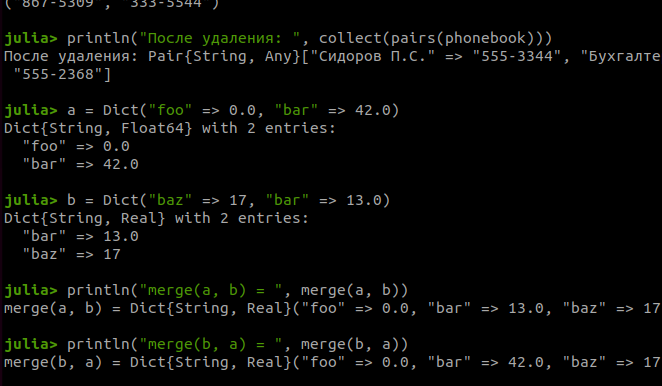
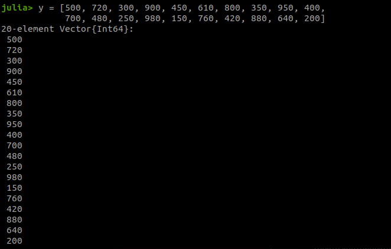
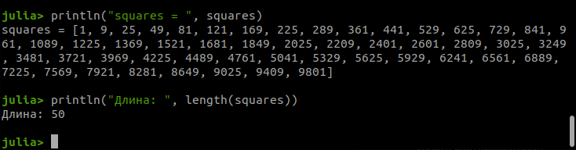
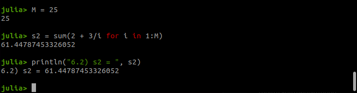
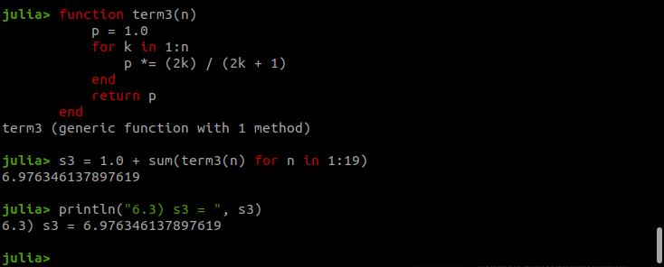

---
## Author
author:
  name: Еремина Оксана Андреевна
  degrees: DSc
  orcid: 0000-0002-0877-7063
  email: 1132236056@rudn.ru
  affiliation:
    - name: Российский университет дружбы народов
      country: Российская Федерация
      postal-code: 117198
      city: Москва
      address: ул. Миклухо-Маклая, д. 6
## Title
title: Отчет по лабораторной работе №2
subtitle: Структуры данных 
license: CC BY
date: today
date-format: "YYYY-MM-DD" # Example: 2025-09-06
---

# Информация

## Докладчик

:::::::::::::: {.columns align=center}
::: {.column width="70%"}

  * Еремина Оксана Андреевна
  * студентка 4 курса 
  * Российский университет дружбы народов им. П. Лумумбы
  * [113223@rudn6056.ru](mailto:1132236056@rudn.ru)
  * <https://oaeremina.github.io/ru/>

:::
::: {.column width="30%"}

:::
::::::::::::::

::: notes
- Поприветствовать аудиторию.
- Представиться кратко, даже если вас объявили.
:::

# Вводная часть

## Актуальность

- Изучение структур данных — фундаментальная часть подготовки IT-специалистов
- Владение различными структурами позволяет эффективно решать прикладные задачи
- Julia предоставляет мощный инструментарий для работы с данными

::: notes
- Почему именно *структура* презентации важна.
- Время: не более 1 минуты на этот слайд.
:::

## Цели работы 

- Изучить основные структуры данных в языке Julia
- Освоить методы их создания, преобразования и анализа
- Получить практические навыки работы с генераторами и внешними пакетами

::: notes
- Обратить внимание, задач ровно три.
- Это удобно для восприятия.
:::

## Задачи

- Изучить синтаксис и операции над множествами
- Освоить создание и обработку кортежей
- Научиться применять генераторы списков
- Изучить методы фильтрации, сортировки и статистического анализа
- Подключить и использовать внешние пакеты (на примере `Primes`)

## Материалы и методы

- Среда разработки: JupyterLab
- Язык программирования: Julia (версия 1.12)
- Внешний пакет: `Primes` для работы с простыми числами
- Все вычисления проводились на локальной машине

::: notes
- Предлагается использовать наиболее популярные форматы.
- `Makefile` позволяет одной командой собрать все форматы.
:::

# Выполнение работы

## Обзор выполненной работы

- Выполнены все задания из раздела 2.4 методических указаний
- Работа включает 6 основных заданий:
    - Множества
    - Примеры с разными типами
    - Создание массивов разными способами (14 пунктов)
    - Квадраты чисел
    - Простые числа
    - Вычисление выражений
    
 ## Задание 1. Множества

- Даны множества: A = {0, 3, 4, 9}, B = {1, 3, 4, 7}, C = {0, 1, 2, 4, 7, 8, 9}
- Необходимо найти: $P = A \cap B \cup A \cap C \cup B \cap C$
- Использованы операции: `union` (объединение), `intersect` (пересечение)

{#fig-002 width=60%}

## Задание 2. Примеры с разными типами

- Созданы множества целых чисел, строк и смешанных типов. Выполнены операции объединения и пересечения, операция разности и проверка принадлежности

{#fig-003 width=60%}

### Задание 3. Множества

Созданы кортежи с последовательностями чисел от 1 до N (N=25): возрастающие, убывающие, симметричные, а также произвольный кортеж (рис. -@fig-005).

{#fig-005 width=70%}

### Задание 4. Массивы

Создан массив квадратов чисел от 1 до 100, выведены первые и последние 10 элементов (рис. -@fig-014).

{#fig-014 width=70%}

### Задание 5. Операции над векторами x и y 

{#fig-015 width=70%}

### Задание 6. Squares

{#fig-016 width=70%}

### Задание 7. Primes

{#fig-016 width=70%}

### Задание 8.1 Вычисление выражений

{#fig-016 width=70%}

### Задание 8.2 Вычисление выражений

{#fig-016 width=70%}

### Задание 8.3 Вычисление выражений

{#fig-016 width=70%}

# Результаты

## Итоги работы

- Изучены синтаксис и операции для кортежей, словарей, множеств и массивов в Julia
- Успешно выполнены все 14 пунктов заданий для самостоятельной работы
- Получены числовые результаты для задач 3.9, 3.10, 3.14, 6.1, 6.2, 6.3
- Сформированы векторы и массивы в соответствии с заданиями

## Обсуждение результатов

- Результаты полностью соответствуют ожидаемым
- Использование генераторов списков и встроенных функций Julia позволило компактно решить задачи
- Трудностей при выполнении не возникло

# Заключение

## Главный вывод

В ходе лабораторной работы были изучены основные структуры данных в Julia. Все задания выполнены в полном объеме. Цель работы достигнута.
