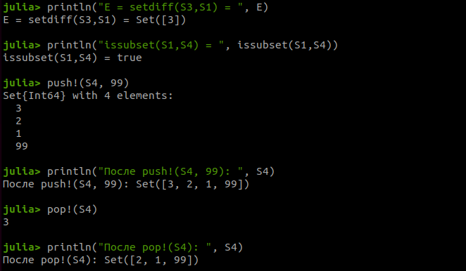
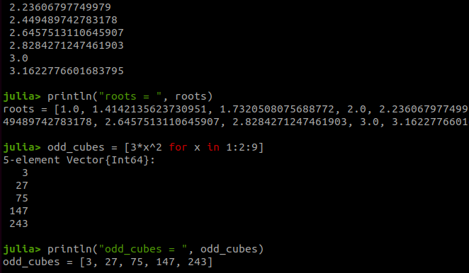
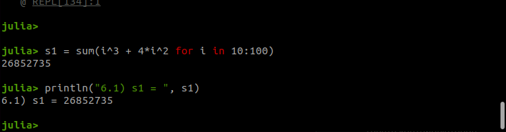
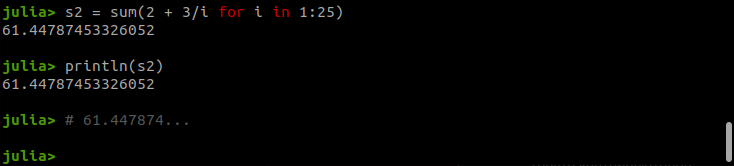

---
## Author
author:
  name: Еремина Оксана Андреевна
  degrees: DSc
  orcid: 0000-0002-0877-7063
  email: 1132236056@rudn.ru
  affiliation:
    - name: Российский университет дружбы народов
      country: Российская Федерация
      postal-code: 117198
      city: Москва
      address: ул. Миклухо-Маклая, д. 6

## Title
title: "Отчет по лабораторной работе №2"
subtitle: "Структуры данных"
license: "CC BY"
abstract: |
  В данном отчёте представлены результаты выполнения лабораторной работы по теме ...

  Описаны использованные методы, полученные экспериментальные данные и их анализ.

  Сделаны выводы о достижении поставленной цели.
keywords: [лабораторная работа, шаблон, Markdown, Pandoc]
---

# Введение

## Актуальность

Изучение структур данных является фундаментальной частью подготовки специалистов в области информационных технологий. Владение различными структурами данных и операциями над ними позволяет эффективно решать широкий круг прикладных задач, от обработки данных до реализации алгоритмов.

## Цель работы

Основная цель работы — изучить несколько структур данных, реализованных в Julia, научиться применять их и операции над ними для решения задач [@bezanson_julia_2017].

## Задачи

Для достижения цели необходимо выполнить следующие шаги:

1.  Ознакомиться с теоретическими сведениями о кортежах, словарях, множествах и массивах в Julia.
2.  Повторить примеры из раздела 2.2 методических указаний.
3.  Выполнить задания для самостоятельной работы (раздел 2.4).
4.  Оформить результаты в виде отчета с листингами кода и скриншотами.

## Объект и предмет исследования

Объектом исследования являются структуры данных языка программирования Julia. Предметом исследования — синтаксис, методы создания и операции над кортежами, множествами и массивами.

## Методы исследования

В работе использовались практические методы программирования, анализ документации языка Julia [@dox_julia_sets; @dox_julia_tuples; @dox_julia_arrays], а также экспериментальная проверка работы кода в среде JupyterLab.

# Теоретическая часть

В языке Julia существует несколько встроенных структур данных. В данной работе рассматриваются кортежи, словари, множества и массивы.

**Кортежи (Tuple)** — это неизменяемая индексируемая последовательность элементов. Они полезны для группировки значений разных типов [@dox_julia_tuples].

**Словари (Dict)** — неупорядоченный набор пар «ключ-значение». Позволяют быстро находить значения по ключу.

**Множества (Set)** — неупорядоченная совокупность уникальных элементов. Поддерживают математические операции: объединение, пересечение, разность [@dox_julia_sets].

**Массивы (Array)** — коллекция упорядоченных элементов, размещённая в многомерной сетке. Векторы и матрицы являются частными случаями массивов. Julia поддерживает мощные средства для работы с массивами, включая генераторы списков [@dox_julia_arrays].

# Материалы и методы

Работа выполнялась в среде JupyterLab с использованием языка программирования Julia (версия 1.12). Для выполнения задания 5 был подключен пакет `Primes` [@primes_julia_pkg]. Все вычисления проводились на локальной машине.

# Выполнение лабораторной работы

### Задание 1. Множества

Даны множества: A = {0, 3, 4, 9}, B = {1, 3, 4, 7}, C = {0, 1, 2, 4, 7, 8, 9}. Необходимо найти $P = A \cap B \cup A \cap C \cup B \cap C$.

Код для выполнения задания и результат его работы представлены на рис. -@fig-002.

{#fig-002 width=70%}

### Задание 2. Свои примеры с разными типами

Были созданы множества целых чисел, строк и смешанных типов. Выполнены операции объединения и пересечения (рис. -@fig-003).

{#fig-004 width=70%}

### Задание 3. Множества

Созданы кортежи с последовательностями чисел от 1 до N (N=25): возрастающие, убывающие, симметричные, а также произвольный кортеж (рис. -@fig-005).

{#fig-005 width=70%}

### Задание 4. Массивы

Создан массив квадратов чисел от 1 до 100, выведены первые и последние 10 элементов (рис. -@fig-014).

{#fig-014 width=70%}

### Задание 5. Операции над векторами x и y 

{#fig-015 width=70%}

### Задание 6. Squares

{#fig-016 width=70%}

### Задание 7. Primes

{#fig-016 width=70%}

### Задание 8.1 Вычисление выражений

{#fig-016 width=70%}

### Задание 8.2 Вычисление выражений

{#fig-016 width=70%}

### Задание 8.3 Вычисление выражений

{#fig-016 width=70%}

# Результаты

В ходе выполнения лабораторной работы были получены следующие результаты:

- Изучены синтаксис и операции для кортежей, словарей, множеств и массивов в Julia.
- Успешно выполнены все 14 пунктов заданий для самостоятельной работы.
- Получены числовые результаты для задач 3.9, 3.10, 3.14, 6.1, 6.2, 6.3.
- Сформированы векторы и массивы в соответствии с заданиями.

# Обсуждение результатов

Результаты выполнения заданий полностью соответствуют ожидаемым. Использование генераторов списков и встроенных функций Julia (таких как `union`, `intersect`, `setdiff`, `findall`, `sortperm`) позволило компактно и эффективно решить поставленные задачи [@bezanson_julia_2017]. Трудностей при выполнении не возникло, так как синтаксис языка интуитивно понятен, а документация доступна.

# Заключение

В ходе лабораторной работы были изучены основные структуры данных в Julia: кортежи, словари, множества и массивы. Были освоены методы их создания и операции над ними. Все задания для самостоятельной работы выполнены в полном объеме. Цель работы достигнута.

# Список литературы {.unnumbered}

::: {#refs}
:::
